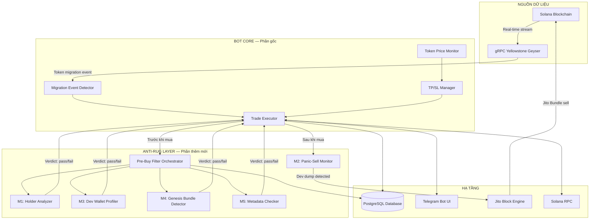
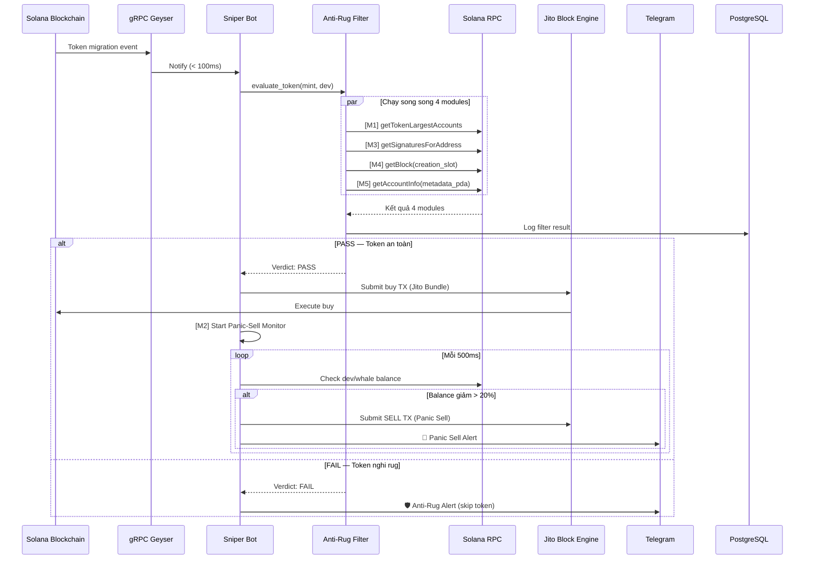

# 📘 BÁO CÁO CƠ SỞ DỰ ÁN
# Migration Sniper Bot — Anti-Rug Intelligence Layer

---

## I. NHIỆM VỤ CHÍNH CỦA DỰ ÁN

### Vấn đề cần giải quyết

Trên blockchain Solana, khi một token trên **Pump.fun** đạt đủ thanh khoản (~$69,000 market cap), nó sẽ tự động **migrate** (chuyển) sang sàn giao dịch phi tập trung **PumpSwap/Raydium**. 

Đây là cơ hội mua sớm vì:
- Token vừa lên sàn lớn → nhiều người sẽ mua → giá tăng
- Ai mua **đầu tiên** (trong vài giây) → lời nhiều nhất

**Nhưng có rủi ro lớn:** Nhiều token là **rug-pull** (lừa đảo):
- Dev tạo token giả → bơm giá → rút thanh khoản → nhà đầu tư mất hết tiền
- ~70-80% token mới trên Pump.fun là rug

### Giải pháp: Migration Sniper Bot + Anti-Rug Intelligence

Bot này làm 2 việc chính:

1. **SNIPER** — Phát hiện token migrate trong **< 1 giây** và tự động mua trước mọi người
2. **ANTI-RUG** — Phân tích token bằng 5 module AI trước khi mua, lọc bỏ token lừa đảo

```
Token migrate → Bot phát hiện (< 1s) → Anti-Rug Filter (5 modules) → 
    ├── PASS → Tự động MUA → Monitor → Phát hiện dump → Tự động BÁN
    └── FAIL → SKIP (không mua) → Alert Telegram
```

---

## II. SƠ ĐỒ TƯ DUY DỰ ÁN

### Kiến trúc tổng thể



### Luồng xử lý chi tiết



---

## III. GIẢI THÍCH THUẬT NGỮ VÀ VIẾT TẮT

### A. Blockchain & Solana

| Thuật ngữ | Viết tắt | Giải thích |
|-----------|----------|------------|
| **Blockchain** | BC | Sổ cái phân tán, lưu trữ mọi giao dịch công khai, không thể sửa đổi |
| **Solana** | SOL | Blockchain tốc độ cao (~400ms/block), phí giao dịch rất thấp (~$0.0001) |
| **SOL** | - | Đồng tiền chính trên Solana (1 SOL ≈ $150) |
| **Lamports** | - | Đơn vị nhỏ nhất của SOL. 1 SOL = 1,000,000,000 lamports |
| **Token** | - | Đồng tiền do người dùng tạo ra trên Solana (ví dụ: memecoin) |
| **Mint** | - | Địa chỉ định danh duy nhất của một token trên blockchain |
| **Pubkey** | PK | Public Key — địa chỉ ví công khai (dùng để nhận tiền) |
| **Private Key** | SK | Secret Key — khóa bí mật (dùng để ký giao dịch, chuyển tiền) |
| **Wallet** | - | Ví chứa SOL và token, gồm cặp pubkey + private key |
| **Transaction** | TX | Giao dịch — một hành động trên blockchain (mua, bán, chuyển tiền) |
| **Block** | - | Nhóm các TX được xử lý cùng lúc (~400ms/block trên Solana) |
| **Slot** | - | Đơn vị thời gian trên Solana, mỗi slot ≈ 1 block ≈ 400ms |
| **RPC** | Remote Procedure Call | Giao thức để bot gọi đến node Solana lấy dữ liệu |
| **gRPC** | Google RPC | Phiên bản nhanh hơn của RPC, dùng streaming real-time |

### B. DeFi & Trading

| Thuật ngữ | Viết tắt | Giải thích |
|-----------|----------|------------|
| **DeFi** | Decentralized Finance | Tài chính phi tập trung — giao dịch không qua ngân hàng/sàn tập trung |
| **DEX** | Decentralized Exchange | Sàn giao dịch phi tập trung (Raydium, PumpSwap) |
| **Pump.fun** | - | Nền tảng tạo memecoin trên Solana, token tự động migrate khi đạt $69k |
| **PumpSwap** | - | Sàn DEX do Pump.fun phát triển, nơi token migrate tới |
| **Raydium** | - | Sàn DEX lớn nhất trên Solana |
| **Migration** | - | Quá trình token chuyển từ Pump.fun bonding curve → PumpSwap/Raydium |
| **Liquidity** | LP | Thanh khoản — lượng tiền trong pool cho phép mua/bán |
| **Bonding Curve** | - | Công thức toán học quyết định giá token trên Pump.fun |
| **Slippage** | - | Độ trượt giá — chênh lệch giữa giá mong muốn và giá thực tế |
| **TP** | Take Profit | Chốt lời — tự bán khi giá tăng đến mức mong muốn |
| **SL** | Stop Loss | Cắt lỗ — tự bán khi giá giảm đến mức chấp nhận |
| **Sniper** | - | Bot mua token cực nhanh (trong vài giây) khi vừa lên sàn |

### C. Rug-Pull & Bảo mật

| Thuật ngữ | Viết tắt | Giải thích |
|-----------|----------|------------|
| **Rug-Pull** | Rug | Hình thức lừa đảo: dev tạo token → bơm giá → rút hết tiền → token mất giá trị |
| **Anti-Rug** | - | Hệ thống phát hiện và ngăn chặn rug-pull trước khi mua |
| **Dev Wallet** | Dev | Ví của người tạo token — cần theo dõi vì dev thường là người rug |
| **Whale** | - | Ví nắm giữ lượng lớn token — có thể gây biến động giá lớn |
| **Holder Concentration** | - | Mức độ tập trung token — nếu top 10 ví nắm >30% → nguy hiểm |
| **Genesis Bundle** | - | Kỹ thuật rug: dev tạo nhiều ví, mua hàng loạt ngay block đầu tiên |
| **Panic Sell** | - | Bán khẩn cấp khi phát hiện dev/whale đang dump |
| **Bundle** | - | Nhóm TX gửi cùng lúc qua Jito để đảm bảo thực thi ưu tiên |

### D. Công nghệ & Hạ tầng

| Thuật ngữ | Viết tắt | Giải thích |
|-----------|----------|------------|
| **Rust** | - | Ngôn ngữ lập trình hiệu suất cao, dùng để viết bot |
| **Cargo** | - | Trình quản lý package và build cho Rust |
| **Tokio** | - | Framework async cho Rust, cho phép chạy nhiều task đồng thời |
| **VPS** | Virtual Private Server | Server ảo thuê từ xa, chạy bot 24/7 |
| **SSH** | Secure Shell | Giao thức kết nối an toàn vào VPS từ xa |
| **SCP** | Secure Copy | Lệnh copy file an toàn từ máy local → VPS |
| **Docker** | - | Công nghệ đóng gói ứng dụng vào container để deploy dễ dàng |
| **Systemd** | - | Hệ thống quản lý dịch vụ trên Linux, tự restart bot khi crash |
| **PostgreSQL** | PG/DB | Hệ quản trị cơ sở dữ liệu, lưu wallet + filter logs |
| **SeaORM** | - | Thư viện Rust để tương tác với PostgreSQL |
| **Telegram Bot** | TG | Bot trên Telegram để điều khiển và nhận alert |
| **Jito** | - | Dịch vụ MEV trên Solana, cho phép gửi TX ưu tiên (bundle) |
| **Yellowstone Geyser** | - | Plugin Solana cho phép stream dữ liệu real-time qua gRPC |
| **Shyft** | - | Nhà cung cấp RPC/gRPC cho Solana (dùng trong dự án này) |
| **Metaplex** | - | Tiêu chuẩn metadata cho token trên Solana (tên, ảnh, URI) |
| **PDA** | Program Derived Address | Địa chỉ được tính toán từ program + seeds, không cần private key |
| **MEV** | Maximal Extractable Value | Giá trị tối đa có thể trích xuất từ việc sắp xếp thứ tự TX |
| **CU** | Compute Units | Đơn vị tính toán trên Solana, mỗi TX tiêu tốn CU |

### E. Các Module Anti-Rug

| Module | Tên đầy đủ | Chức năng |
|--------|-----------|-----------|
| **M1** | Holder Concentration Analyzer | Kiểm tra top 10 holders có nắm quá nhiều supply không |
| **M2** | Dynamic Panic-Sell via Jito | Theo dõi dev/whale, tự bán nếu phát hiện dump |
| **M3** | Dev Wallet Profiler | Kiểm tra lịch sử ví dev (tuổi, số TX) |
| **M4** | Genesis Bundle Detector | Phát hiện mua hàng loạt trong block đầu tiên |
| **M5** | Metadata Checker | Kiểm tra token có metadata hợp lệ không |

---

## IV. BẢNG TÓM TẮT DỰ ÁN

| Hạng mục | Chi tiết |
|----------|---------|
| **Tên dự án** | Migration Sniper Bot — Anti-Rug Intelligence Layer |
| **Ngôn ngữ** | Rust (Edition 2024) |
| **Blockchain** | Solana (Mainnet) |
| **Mục đích** | Tự động mua token mới + lọc bỏ token lừa đảo (rug-pull) |
| **Kiến trúc** | Microservice: Bot Core + 5 Anti-Rug Modules + DB + Telegram |
| **Hạ tầng** | VPS Frankfurt + PostgreSQL + Systemd + Docker |
| **Kết nối** | gRPC (real-time) + RPC (on-demand) + Jito (priority TX) |
| **Giao diện** | Telegram Bot (điều khiển + nhận alert) |
| **Bảo mật** | Wallet encryption + Telegram user ID whitelist |
| **Testing** | 16 unit tests + paper-trading 24h |

---

## V. SƠ ĐỒ CẤU TRÚC THƯ MỤC

```
Snipe-blockchain/
├── Cargo.toml                    ← Config dự án Rust
├── Dockerfile                    ← Build Docker image
├── docker-compose.yml            ← Deploy PostgreSQL + Bot
├── .env                          ← Biến môi trường (token, password)
│
├── src/
│   ├── entry_point/
│   │   ├── migration_sniper_mode.rs  ← MAIN — khởi chạy bot
│   │   └── init_db.rs                ← Tạo bảng database
│   │
│   ├── features/
│   │   └── handle_sniper/
│   │       └── execute_trade.rs      ← Logic mua/bán + inject Anti-Rug
│   │
│   ├── modules/
│   │   ├── anti_rug/                 ← ★ PHẦN THÊM MỚI ★
│   │   │   ├── mod.rs                ← Exports
│   │   │   ├── config.rs             ← Cấu hình thresholds
│   │   │   ├── pre_buy_filter.rs     ← Orchestrator (chạy 4 modules song song)
│   │   │   ├── filter_result.rs      ← Struct kết quả filter
│   │   │   ├── holder_analyzer.rs    ← [M1] Kiểm tra holder
│   │   │   ├── panic_sell.rs         ← [M2] Jito panic sell
│   │   │   ├── dev_wallet_profiler.rs← [M3] Kiểm tra ví dev
│   │   │   ├── genesis_detector.rs   ← [M4] Phát hiện genesis bundle
│   │   │   └── metadata_checker.rs   ← [M5] Kiểm tra metadata
│   │   │
│   │   ├── telegram_ui/
│   │   │   ├── mod.rs                ← Telegram bot handler
│   │   │   ├── run_state.rs          ← Trạng thái bot (+ anti_rug config)
│   │   │   └── alert_sender.rs       ← ★ MỚI ★ Gửi alert Telegram
│   │   │
│   │   ├── postgresql/
│   │   │   ├── db.rs                 ← CRUD database (+ log filter)
│   │   │   ├── entities/             ← SeaORM entities
│   │   │   └── migration/            ← DB migrations
│   │   │
│   │   ├── grpc/                     ← Kết nối gRPC Yellowstone
│   │   ├── rpc/                      ← Kết nối Solana RPC
│   │   ├── parse/                    ← Parse dữ liệu blockchain
│   │   └── token_db/                 ← In-memory token cache
│   │
│   └── config/                       ← Cấu hình chung
│
└── docs/                             ← Tài liệu
    ├── PHASE_1_COMPLETION_REPORT.md
    ├── audit_fix_plan.md
    └── demo_test_guide.md
```

---

## VI. TỔNG KẾT

Dự án này giải quyết bài toán **tự động hóa giao dịch token mới trên Solana** với lớp bảo vệ chống lừa đảo. Bot hoạt động 24/7 trên VPS, phát hiện token migrate trong < 1 giây, phân tích rủi ro bằng 5 module, và tự động mua/bán thông qua Jito Bundle để đạt tốc độ ưu tiên cao nhất.
